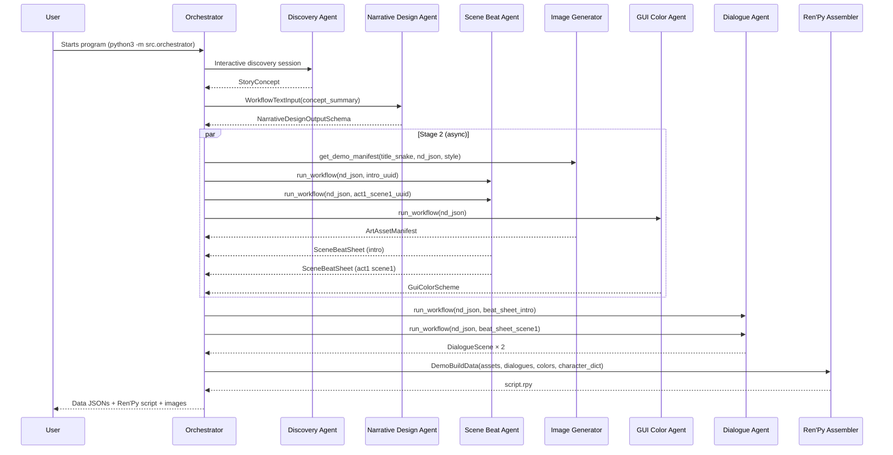

# Karla Module Workflow

This document explains the end-to-end workflow of the current MVP, starting at the entry point in [src/orchestrator.py](src/orchestrator.py). It focuses on how modules collaborate, the design patterns in use, and the Pydantic `BaseModel` schemas that define contracts between stages.

## How To Run

- Prereqs: `.env` configured (OpenAI credentials, paths), dependencies from `requirements.txt`, and a Python 3.11+ venv.
- Run the MVP vertical slice from the project root:

```bash
python3 -m src.orchestrator
```

- Result: A per-game folder is created under `KARLA_GAMES/<snake_case_title>/` with:
  - `DATA/creative_data.json`, `DATA/build_data.json`, and `DATA/script.rpy`
  - `IMAGES/` with generated backgrounds and character portraits

Key environment variables used by the pipeline:
- `GAMES_FOLDER_PATH`: Root folder for per-game workspaces
- `CREATION_DATA_FOLDER_NAME`: Name of the data subfolder (e.g., `DATA`)
- `GAME_IMAGES_FOLDER_NAME`: Name of the images subfolder (e.g., `IMAGES`)
- `IMAGE_CREATION_QUALITY`: Image generation quality passed to the image tool

## High-Level Flow



## Entry Point and Stages

- Orchestrator: [src/orchestrator.py](src/orchestrator.py)
  - Stage 0: Discovery interview → `StoryConcept`
  - Stage 1: Narrative design → `NarrativeDesignOutputSchema`
  - Stage 2 (async): Images → `ArtAssetManifest`; Beats → `SceneBeatSheet`×2; GUI → `GuiColorScheme`
  - Stage 3 (async): Dialogue → `DialogueScene`×2; assembly → `.rpy`
  - Writes `creative_data.json`, `build_data.json`, and saves `script.rpy` + images.

Concurrency is implemented with `asyncio.gather` to parallelize independent work (art, beats, GUI; then dialogue scenes).

## Design Patterns and Principles

- Schema-first handoffs: Every agent returns a Pydantic `BaseModel` that becomes the explicit contract for downstream modules.
- Early stable IDs: Scenes, characters, and locations receive UUIDs at the narrative layer and are reused throughout (beats, dialogue, assets, `.rpy`).
- Orchestrator-as-application-service: The orchestrator coordinates sequencing, validation, parallelism, and file output; agents focus on domain-specific generation.
- Deterministic assembly: LLMs produce structured content; Python assembles predictable `.rpy` text, filenames, and folders.
- Thin, testable vertical slice: Intro + Act I Scene 1 only, with deterministic structure for inspection and grading.

## Data Contracts (Pydantic Schemas)

The following `BaseModel` schemas define the pipeline’s contracts. Field lists focus on what downstream stages rely upon.

### Discovery
- `StoryConcept` ([src/discovery_agent.py](src/discovery_agent.py))
  - premise, genre?, tone?, setting?, protagonist?, core_hook, must_have_elements[], avoid_elements[], concept_summary

### Narrative Design
- `CharacterData`, `LocationData`, `PlayerCharacter`, `NonPlayerCharacter`, `SceneData`, `Scene`
- `NarrativeDesignOutputSchema` ([src/narrative_design_agent.py](src/narrative_design_agent.py))
  - story_title, synopsis, player_character, non_player_characters[], locations[]
  - intro_scene, act_one[], act_two[], act_three[], outro_scene
  - Helper catalogs: `get_character_catalog()`, `get_location_catalog()`, `get_scene_catalog()`

### Scene Planning
- `SceneBeat` and `SceneBeatSheet` ([src/scene_beat_agent.py](src/scene_beat_agent.py))
  - `SceneBeat`: beat_index, beat_name, purpose, summary, location_uuid, present_character_uuids[], focal_character_uuid?, mood, revelation?, tension_change, player_goal?, interactive, choice_prompt?, branch_outcomes?, exit_state
  - `SceneBeatSheet`: story_title, scene_name, scene_uuid, source_scene_summary, location_name/uuid, player_character_uuid, non_player_character_uuids[], dramatic_question, scene_goal, scene_turn, beats[]

### GUI Theme
- `RBGA8` and `GuiColorScheme` ([src/gui_color_agent.py](src/gui_color_agent.py))
  - Colors encoded as 8-bit RGBA and computed `hex_string`; reasons included for instructor review

### Image Generation
- `ArtAssetManifest` ([src/image_generator.py](src/image_generator.py))
  - character_portrait_paths[], scene_background_paths[]
  - Composition constraints enforced in prompts; background transparency required for portraits

### Dialogue Structure
- `DialogueScene` ([src/dialogue_agent.py](src/dialogue_agent.py))
  - scene_uuid, scene_name, location_uuid, dialogue_beats[], scene_exit_state, notes_and_work_product_summary
- `DialogueBeat`
  - beat_index, beat_name, source_purpose, source_exit_state, events[]
- `DialogueEvent` discriminated union (type):
  - `set_background`, `show_character`, `hide_character`, `line`, `narration`, `choice`
- `ChoiceEvent` and `DialogueChoiceOption` for branching inside a beat (no nested choices)

### Build/Assembly
- `DemoBuildData` ([src/renpy_script_assembler.py](src/renpy_script_assembler.py))
  - art_assets, dialogue_scenes[], gui_colors, character_dict (uuid→name)
- `DemoCreativeData` ([src/orchestrator.py](src/orchestrator.py))
  - narrative_design_spec, art_assets, beat_sheets[], color_scheme

## Module Responsibilities

- Discovery Agent ([src/discovery_agent.py](src/discovery_agent.py))
  - Conducts a short interview; summarizes to `StoryConcept` via a dedicated summarizer agent.

- Narrative Design Agent ([src/narrative_design_agent.py](src/narrative_design_agent.py))
  - Produces a full story package with stable IDs and helper catalogs; includes a human-readable formatter for inspection.

- Scene Beat Agent ([src/scene_beat_agent.py](src/scene_beat_agent.py))
  - Transforms a scene’s narrative summary into a playable plan with beats, tension changes, interactivity, and exit states.

- Image Generator ([src/image_generator.py](src/image_generator.py))
  - Writes backgrounds and dialogue portraits to `IMAGES/`; returns an `ArtAssetManifest` with file paths. Enforces strict portrait composition and transparency.

- GUI Color Agent ([src/gui_color_agent.py](src/gui_color_agent.py))
  - Returns a lightweight theme (`GuiColorScheme`) aligned to story mood for basic presentation polish.

- Dialogue Agent ([src/dialogue_agent.py](src/dialogue_agent.py))
  - Converts a `SceneBeatSheet` to a structured `DialogueScene`, preserving order, presence, and interactivity rules.

- Ren'Py Script Assembler ([src/renpy_script_assembler.py](src/renpy_script_assembler.py))
  - Deterministically compiles `DialogueScene` events into `.rpy` text. Handles `set_background`, portrait show/hide, dialogue, narration, and per-beat local choices with jump/rejoin labels.

## Output Artifacts and Layout

For each generated game (title converted to snake_case):

```
KARLA_GAMES/<game>/
  DATA/
    creative_data.json     # Narrative spec, art manifest, beat sheets, colors
    build_data.json        # Assembly-ready data
    script.rpy             # Ren'Py script assembled from DialogueScenes
  IMAGES/
    <character_uuid>.png   # Transparent portrait
    bg <location_uuid>.png # Backgrounds
```

The script and assets can be copied into a blank Ren'Py project to play the vertical slice (intro + first scene). The assembler emits a preamble with transforms and starts at `label start:`.

## Notes for Evaluation

- Contracts are verifiable via `model_json_schema()` or by opening the referenced files.
- The orchestrator intentionally limits scope to maintain deterministic, gradable outputs.
- Parallelization reduces wall-clock time and demonstrates safe agent boundaries.
- All LLM-facing work is constrained by explicit schemas, composition rules, and non-nested branching.

## Future Work (Planned)

- Stronger schema validation and guardrails across handoffs
- Automated Ren'Py project scaffolding and direct export
- Broader scene coverage and reconvergence patterns
- Web UI for discovery and run control

---

## Appendix: Schema Field Tables

The tables below summarize each `BaseModel` used as a handoff contract in the pipeline. Types are simplified for readability; see source files for exact annotations and validators.

### Discovery

Schema: `StoryConcept` (src/discovery_agent.py)

| Field | Type | Required | Description |
|---|---|---|---|
| premise | str | yes | Core story premise. |
| genre | str | no | Primary genre. |
| tone | str | no | Emotional flavor. |
| setting | str | no | Place/time/world context. |
| protagonist | str | no | Player character info. |
| core_hook | str | yes | Central conflict or hook. |
| must_have_elements | list[str] | no (default []) | Elements to include. |
| avoid_elements | list[str] | no (default []) | Elements to avoid. |
| concept_summary | str | yes | 3–4 sentence handoff summary. |

Also used: `WorkflowTextInput` (src/narrative_design_agent.py)

| Field | Type | Required | Description |
|---|---|---|---|
| input_as_text | str | yes | High-level concept passed to Narrative Design. |

### Narrative Design

Sub-schemas (src/narrative_design_agent.py)

Schema: `CharacterData`

| Field | Type | Required | Description |
|---|---|---|---|
| uuid | str | yes | Unique character UUID. |
| name | str | yes | Character name. |
| portrait_image_prompt | str | yes | Visual description for portrait generation. |
| dialogue_examples | list[str] | yes | Example lines for tone/voice. |

Schema: `LocationData`

| Field | Type | Required | Description |
|---|---|---|---|
| uuid | str | yes | Unique location UUID. |
| name | str | yes | Location name. |
| location_image_prompt | str | yes | Background art description. |

Schema: `Location`

| Field | Type | Required | Description |
|---|---|---|---|
| location_data | LocationData | yes | Location record. |

Schema: `PlayerCharacter`

| Field | Type | Required | Description |
|---|---|---|---|
| character_data | CharacterData | yes | Player character record. |

Schema: `NonPlayerCharacter`

| Field | Type | Required | Description |
|---|---|---|---|
| character_data | CharacterData | yes | NPC record. |

Schema: `SceneData`

| Field | Type | Required | Description |
|---|---|---|---|
| uuid | str | yes | Unique scene UUID. |
| scene_name | str | yes | Stable human-readable scene ID. |
| location_uuid | str | yes | UUID of scene location. |
| non_player_character_uuids | list[str] | no | NPCs present in scene. |
| narrative_summary | str | yes | Brief scene summary. |

Schema: `Scene`

| Field | Type | Required | Description |
|---|---|---|---|
| scene_data | SceneData | yes | Scene record. |

Schema: `NarrativeDesignOutputSchema`

| Field | Type | Required | Description |
|---|---|---|---|
| story_title | str | yes | Title of the story. |
| synopsis | str | yes | Overall plot/setting/tone. |
| player_character | PlayerCharacter | yes | Protagonist record. |
| non_player_characters | list[NonPlayerCharacter] | yes | NPC list. |
| locations | list[Location] | yes | Location list. |
| intro_scene | Scene | yes | Prologue scene. |
| act_one | list[Scene] | yes | Ordered act I scenes. |
| act_two | list[Scene] | yes | Ordered act II scenes. |
| act_three | list[Scene] | yes | Ordered act III scenes. |
| outro_scene | Scene | yes | Denouement scene. |

Helper methods: `get_character_catalog()`, `get_location_catalog()`, `get_scene_catalog()`, `get_scene_by_scene_synopsis()`, `human_readable()`.

### Scene Planning

Schema: `SceneBeat` (src/scene_beat_agent.py)

| Field | Type | Required | Description |
|---|---|---|---|
| beat_index | int | yes | 1-based beat position. |
| beat_name | str | yes | Stable beat identifier. |
| purpose | str | yes | Why this beat exists. |
| summary | str | yes | What happens in 1–3 sentences. |
| location_uuid | str | yes | Where the beat occurs. |
| present_character_uuids | list[str] | yes | Player + active NPC UUIDs. |
| focal_character_uuid | str | no | Character driving the beat. |
| mood | str | yes | Emotional tone. |
| revelation | str | no | New info learned, if any. |
| tension_change | Literal["rise"|"fall"|"twist"|"hold"] | yes | Tension movement. |
| player_goal | str | no | PC goal in this beat. |
| interactive | bool | yes | Beat contains a choice? |
| choice_prompt | str | no | Short description of decision. |
| branch_outcomes | list[str] | no | High-level outcomes per option. |
| exit_state | str | yes | What changed by the end. |

Schema: `SceneBeatSheet`

| Field | Type | Required | Description |
|---|---|---|---|
| story_title | str | yes | Title of the story. |
| scene_name | str | yes | Stable scene ID. |
| scene_uuid | str | yes | Scene UUID. |
| source_scene_summary | str | yes | Narrative summary source. |
| location_name | str | yes | Human-readable location. |
| location_uuid | str | yes | Location UUID. |
| player_character_uuid | str | yes | Player character UUID. |
| non_player_character_uuids | list[str] | yes | Scene NPC UUIDs. |
| dramatic_question | str | yes | Scene’s core uncertainty. |
| scene_goal | str | yes | What the PC wants. |
| scene_turn | str | yes | What changes by the end. |
| beats | list[SceneBeat] | yes | Ordered beat list. |

### GUI Theme

Schema: `RBGA8` (src/gui_color_agent.py)

| Field | Type | Required | Description |
|---|---|---|---|
| r | int (0–255) | yes | Red channel. |
| g | int (0–255) | yes | Green channel. |
| b | int (0–255) | yes | Blue channel. |
| a | int (0–255) | no (default 255) | Alpha channel. |
| hex_string | str | computed | `#RRGGBB` convenience string. |

Schema: `GuiColorScheme`

| Field | Type | Required | Description |
|---|---|---|---|
| accent_color | RBGA8 | yes (default) | Accent color for highlights. |
| idle_color | RBGA8 | yes (default) | Default button text. |
| idle_small_color | RBGA8 | yes (default) | Small button text. |
| hover_color | RBGA8 | yes (default) | Hover state color. |
| selected_color | RBGA8 | yes (default) | Selected state color. |
| insensitive_color | RBGA8 | yes (default) | Disabled state color. |
| muted_color | RBGA8 | yes (default) | Unfilled bar color. |
| hover_muted_color | RBGA8 | yes (default) | Hovered-unfilled bar color. |
| text_color | RBGA8 | yes (default) | Dialogue text color. |
| interface_text_color | RBGA8 | yes (default) | Menu choice text color. |
| reasoning | str | yes | Brief rationale for palette. |

### Image Generation

Schema: `ArtAssetManifest` (src/image_generator.py)

| Field | Type | Required | Description |
|---|---|---|---|
| character_portrait_paths | list[str] | yes | File paths to portrait PNGs. |
| scene_background_paths | list[str] | yes | File paths to background PNGs. |

### Dialogue Structure

Event sub-schemas (src/dialogue_agent.py)

Schema: `LineEvent`

| Field | Type | Required | Description |
|---|---|---|---|
| type | "line" | yes | Discriminator. |
| character_uuid | str | yes | Speaker UUID. |
| text | str | yes | Dialogue line. |

Schema: `NarrationEvent`

| Field | Type | Required | Description |
|---|---|---|---|
| type | "narration" | yes | Discriminator. |
| text | str | yes | Narration text. |

Schema: `ShowCharacterEvent`

| Field | Type | Required | Description |
|---|---|---|---|
| type | "show_character" | yes | Discriminator. |
| character_uuid | str | yes | Character to show. |
| character_expression | one of 7 literals | yes | Facial expression. |
| screen_position | left/center/right | yes | On-screen position. |

Schema: `HideCharacterEvent`

| Field | Type | Required | Description |
|---|---|---|---|
| type | "hide_character" | yes | Discriminator. |
| character_uuid | str | yes | Character to hide. |

Schema: `SetBackgroundEvent`

| Field | Type | Required | Description |
|---|---|---|---|
| type | "set_background" | yes | Discriminator. |
| location_uuid | str | yes | Background location UUID. |

Schema: `DialogueChoiceOption`

| Field | Type | Required | Description |
|---|---|---|---|
| option_id | str | yes | Stable ID like `flirt`, `leave`. |
| option_text | str | yes | What the player sees. |
| branch_events | list[BranchEvent] | yes (min 1) | Events executed after selection. |

Schema: `ChoiceEvent`

| Field | Type | Required | Description |
|---|---|---|---|
| type | "choice" | yes | Discriminator. |
| choice_id | str | yes | Stable ID like `scene1_beat2_choice1`. |
| prompt | str | yes | Player-facing question/prompt. |
| options | list[DialogueChoiceOption] | yes (min 2) | Available options. |
| ends_beat | bool | yes | Whether choice ends the beat. |

Schema: `DialogueBeat`

| Field | Type | Required | Description |
|---|---|---|---|
| beat_index | int (>=1) | yes | Position in scene. |
| beat_name | str | yes | Stable beat ID. |
| source_purpose | str | yes | Purpose mapped from beat sheet. |
| source_exit_state | str | yes | Exit state mapped from beat sheet. |
| events | list[DialogueEvent] | yes (min 1) | Ordered events in the beat. |

Schema: `DialogueScene`

| Field | Type | Required | Description |
|---|---|---|---|
| scene_uuid | str | yes | Scene UUID. |
| scene_name | str | yes | Stable scene ID. |
| location_uuid | str | yes | Location UUID. |
| dialogue_beats | list[DialogueBeat] | yes (min 1) | Ordered dialogue beats. |
| scene_exit_state | str | yes | What changes by the end. |
| notes_and_work_product_summary | str | yes | Brief output summary/notes. |

### Build / Assembly

Schema: `DemoBuildData` (src/renpy_script_assembler.py)

| Field | Type | Required | Description |
|---|---|---|---|
| art_assets | ArtAssetManifest | yes | Image paths for assembly. |
| dialogue_scenes | list[DialogueScene] | yes | Intro + first scene dialogue. |
| gui_colors | GuiColorScheme | yes | Theme colors. |
| character_dict | dict[str,str] | yes | UUID→character name map. |

Schema: `DemoCreativeData` (src/orchestrator.py)

| Field | Type | Required | Description |
|---|---|---|---|
| narrative_design_spec | NarrativeDesignOutputSchema | yes | Canonical story package. |
| art_assets | ArtAssetManifest | yes | Image manifest. |
| beat_sheets | list[SceneBeatSheet] | yes | Intro + first-scene planning. |
| color_scheme | GuiColorScheme | yes | GUI palette. |

