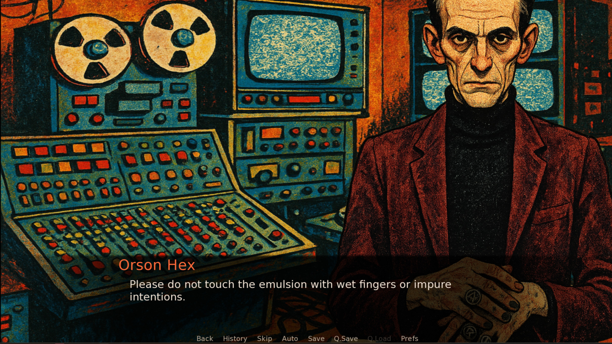
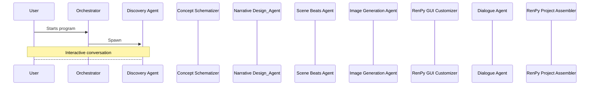

# Project Karla

Project Karla is a proof-of-concept system for generating a playable **Ren'Py** visual novel from a high-level story idea. It is being built as an MVP/demo for a game programming graduation project and as a portfolio piece focused on agent orchestration, structured generation, and AI-assisted content pipelines.

Rather than asking one model to write an entire game end-to-end, Karla breaks the work into specialized agents with explicit handoff schemas. The current direction is a thin vertical slice that can generate enough structured data, art, and scripted content to assemble a small but convincing playable demo.

## What Karla does

A user starts by describing the kind of story they want. Karla then moves that idea through a staged pipeline that turns a rough concept into structured narrative data, beat planning, dialogue-ready scene content, visual assets, and finally Ren'Py-compatible output.

Current MVP goals:

- Accept a high-level story concept through a conversational discovery flow.
- Expand that concept into a structured story plan.
- Generate beat sheets for each scene.
- Produce AI-generated backgrounds and character portraits with structured composition rules, predictable filenames, and project paths.
- Assemble a playable Ren'Py vertical slice with basic branching and reconvergence.

## Why this project exists

Karla is intentionally scoped as a proof of concept, not a production-ready platform. The goal is to demonstrate strong architecture decisions around agent orchestration, schema design, deterministic assembly, and practical AI tooling inside a game-development workflow.

This makes the project useful in two ways: as a graduation project submission and as a portfolio piece for employers interested in LLM orchestration, game tooling, and structured AI pipelines.

## Pipeline

### 1. Discovery Agent
- Input: interactive chat with the user.
- Output: enough clarified story preferences to hand off to a summarizer/concept packager.
- Responsibility: act like a creative interviewer, ask one good question at a time, and stop once the concept is clear enough.

### 2. Story Concept Packager
- Input: discovery conversation.
- Output: a structured `StoryConcept` handoff object with fields such as premise, genre, tone, setting, protagonist, core hook, must-have elements, avoid elements, and concept summary.
- Responsibility: convert open-ended user conversation into a deterministic upstream schema for the rest of the pipeline.

### 3. Narrative Design Agent
- Input: structured story concept.
- Output: a structured story package (`NarrativeDesignOutputSchema`) including title, synopsis, characters, locations, intro, scene lists across the three-act structure, and outro.
- Responsibility: establish the canonical story plan and assign stable scene identifiers early so downstream agents do not infer structure from prose alone.

### 4. Scene Beat Agent
- Input: validated narrative design output plus a target scene ID.
- Output: a `SceneBeatSheet` containing dramatic question, scene goal, scene turn, and an ordered list of beats with tension changes, interactions, and branch opportunities.
- Responsibility: turn broad scene summaries into concrete scene-level planning so dialogue generation stays shaped and testable.

### 5. Dialogue Agent
- Input: beat sheets and character context from the narrative layer.
- Output: structured scene content composed of beat-aligned playable events rather than raw `.rpy` text.
- Responsibility: decide who speaks, what happens, and where choices occur, while leaving exact Ren'Py syntax and deterministic assembly to Python code.

### 6. Asset Manifest Agent
- Input: character and location descriptions from the narrative layer.
- Output: structured image generation jobs with stable IDs, filenames, output paths, prompts, composition rules, and export settings.
- Responsibility: define art jobs explicitly so image generation remains reproducible and downstream assembly can rely on predictable filenames and folder layout.

### 7. GUI Color Scheme Agent
- Input: visual and tonal cues from the story's characters, locations, and overall presentation goals.
- Output: a Ren'Py GUI color configuration expressed as hex values and other simple theme settings.
- Responsibility: generate lightweight presentation settings that help the demo feel visually cohesive with the generated story and assets.

### 8. Ren'Py Assembly Agent
- Input: narrative data, beat sheets, dialogue events, generated assets, and GUI settings.
- Output: deterministic `.rpy` script output and a playable build assembled from a predefined Ren'Py project template.
- Responsibility: compile structured data into engine-ready content without asking the language model to invent Ren'Py syntax ad hoc.

### 9. Orchestrator
- Input: outputs from every stage.
- Output: inputs from every stage, pass/fail checks, schema validation feedback, and debugging data.
- Responsibility: Enforce agent boundaries, coordinate end-to-end workflow.

## Architecture principles

A few design rules currently shape the whole project:

- **Structured handoffs over freeform text.** Each major step should emit explicit schemas, not vague prose blobs.
- **Stable IDs early.** Scene identity should be formalized at the source and reused downstream, especially for beat planning and Ren'Py label generation.
- **Models write creatively; Python assembles deterministically.** The model decides story, beats, dialogue, and choice intent, while Python owns engine syntax, filenames, and assembly rules.
- **Thin vertical slice first.** The current MVP is focused on the intro and Act 1 Scene 1 rather than the whole game.
- **Asset generation should be explicit.** Images are generated from manifest-defined jobs and written to known project paths rather than saved implicitly.

## Current progress

Karla has already crossed the point where the system feels like more than a loose prototype. The Narrative Design Agent and Scene Beat Agent are producing structured outputs that are strong enough to support downstream work, and the current orchestrator already serializes combined creative data into a shared project data model.

A manual Ren'Py preview has also been assembled using Karla-generated images, renamed assets, and sample dialogue derived from the structured data. That preview demonstrated that the current assets and planning outputs are already sufficient to make a small visual novel slice feel coherent on screen.

## Current repo direction

The current orchestration flow creates a per-game workspace, runs the Narrative Design Agent first, gathers demo art manifest data plus beat sheets for the intro and first act scene, and serializes the result into a combined creative data object. The next major step is to lock down the Dialogue Agent contract so structured dialogue events can be compiled into Ren'Py reliably.

In other words, the project is now moving from planning and asset generation into fully structured playable scene generation.

## Example flow

1. The user chats with the Discovery Agent about the kind of story they want.
2. A summarizer converts that conversation into a `StoryConcept`.
3. The Narrative Design Agent expands it into a story package with scenes, characters, and locations.
4. The Scene Beat Agent plans a target scene beat by beat.
5. The Dialogue Agent turns those beats into structured playable events.
6. The Asset Manifest Agent defines the art jobs, and image generation code saves finished assets to the Ren'Py project structure.
7. The Ren'Py assembly layer compiles the structured outputs into a playable vertical slice.

## Pipeline architecture

## Tech focus

The project is currently centered on:

- Ren'Py as the runtime and content assembly target.
- Pydantic schemas for structured contracts between agents.
- OpenAI Agents SDK patterns for orchestration and content generation workflows.
- Python as the deterministic glue layer between model outputs and playable game files.

## Planned improvements

Near-term priorities include:

- Finalize the Dialogue Agent schema and beat-aligned event format.
- Expand deterministic Ren'Py assembly from manually previewed content into automated script generation.
- Strengthen validation rules across schemas and handoff boundaries.
- Improve asset generation presets, portrait framing checks, and manifest-driven file writing.
- Continue hardening the MVP slice before expanding beyond the intro and first playable story scene.

## Status

Project Karla is a work in progress, but it already has a clear architecture, a defined MVP scope, working beat-planning outputs, usable generated art, and a manually assembled Ren'Py preview that validates the direction. The current focus is turning that promising prototype into a cleaner, more automated end-to-end demo.
