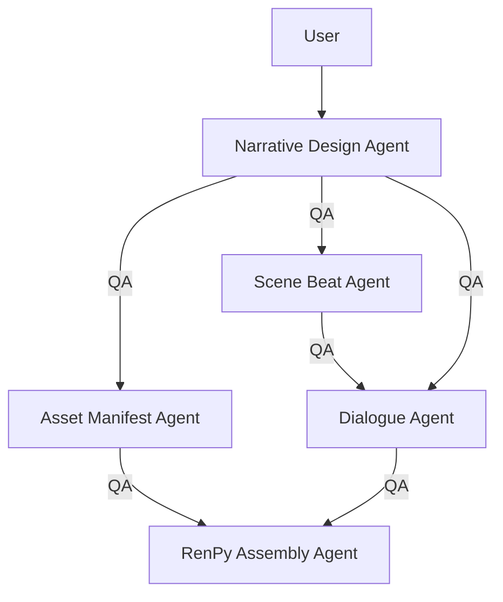

## Current Architecture

Narrative Design Agent:
- Input: High-level story concept from the human user
- Output: Detailed and structured story plan

Scene Beat Agent:
- Input: Structured and validated output from the Narrative Design Agent
- Output: Structured "beat sheets", one per scene. Ordered beats, emotional turns, choice opportunities	Prevents dialogue generation from becoming shapeless.

Dialogue Agent:
- Input: Beat sheets from the Scene Beat Agent, and character context extracted from the Narrative Design Agent's output
- Output: Dialogue lines, menu choices, short branch outcomes. Produces actual playable content for RenPy

Asset Manifest Agent:
- Input: Character and location visual descriptions from the Narrative Design Agent's output
- Output: AI generated image files using RenPy naming conventions

RenPy Assembly Agent:
- Input: All the above outputs
- Output: .rpy script and playable build. Will use a pre-defined RenPy project template

QA/Validator Agent (output guardrail for all the above):
- Input: All generated artifacts
- Output: Pass/Fail, debugging data, etc.

